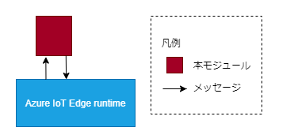
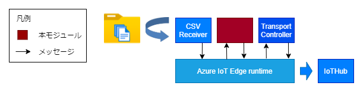

# IdentityMapping

## 目次
* [概要](#概要)
* [機能](#機能)
* [Quick Start](#quick-start)
* [イメージのURL](#イメージのurl)
* [動作保証環境](#動作保証環境)
* [Deployment 設定値](#deployment-設定値)
  * [環境変数](#環境変数)
  * [Desired Properties](#desired-properties)
  * [Create Option](#create-option)
* [受信メッセージ](#受信メッセージ)
  * [Message Body](#message-body)
  * [Message Properties](#message-properties)
* [送信メッセージ](#送信メッセージ)
  * [Message Body](#SendMessageBody)
  * [Message Properties](#SendMessageProperties)
* [Direct Method](#direct-method)
* [ログ出力内容](#ログ出力内容)
* [ユースケース](#ユースケース)
  * [ケース ①](#Usecase1)
* [Feedback](#feedback)
* [LICENSE](#license)

## 概要
IdentityMappingは、メッセージにプロパティ付与を行うAzure IoT edgeモジュールです。

## 機能

入力されたメッセージに対して任意のプロパティを追加／置換してメッセージを受け渡す。<br>
入力されたメッセージに編集するプロパティが設定されている場合、desiredProperty の値が優先され、置換される。



## Quick Start
鋭意製作中

## イメージのURL
準備中
| URL                                                             | Description          |
| --------------------------------------------------------------- | -------------------- |

## 動作保証環境

| Module Version | IoTEdge | edgeAgent | edgeHub  | amd64 verified on | arm64v8 verified on | arm32v7 verified on |
| -------------- | ------- | --------- | -------- | ----------------- | ------------------- | ------------------- |
| 1.0.0          | 1.4.27  | 1.4.27    | 1.4.27   | ubuntu20.04       | －                  | －                  |


## Deployment 設定値

### 環境変数

#### 環境変数の値

| Key                 | Required | Default       | Description                                                                               |
| ------------------- | -------- | ------------- | -------------------------------------------------------------- |
| TransportProtocol   |          | Amqp          | ModuleClientの接続プロトコル。<br>["Amqp", "Mqtt"]                        |
| LogLevel            |          | info          | 出力ログレベル。<br>["trace", "debug", "info", "warn", "error"]           |
| DefaultReceiveTopic |          | IoTHub        | 受信時のトピック形式。<br>["IoTHub", "Mqtt"]                            |
| DefaultSendTopic    |          | IoTHub        | 送信時のトピック形式。 <br>["IoTHub", "Mqtt"]                            |
| M2MqttFlag          |          | false         | 通信に利用するAPIの切り替えフラグ。<br>false ： IoTHubトピックのみ利用可能。<br>true ： IoTHubトピックとMqttトピックが利用可能。ただし、SasTokenの発行と設定が必要。|
| SasToken            | △       |               | M2MqttFlag=true時必須。edgeHubと接続する際に必要なモジュール毎の署名。                                      |

### Desired Properties

#### Desired Properties の値

| JSON Key                                                                  | Type   | Required | Default | Description                                                              |
| ------------------------------------------------------------------------- | ------ | -------- | ------- | ------------------------------------------------------------------------ |
| routes                                                                    | object | 〇       |         | ルートの定義。                                                             |
| &nbsp; route[x]<br>\*キーはなんでもよい(route[x]は重複回避のための推奨値)     | object | 〇       |         | [x]は1から始まる連番。<br>プロパティ定義の判別用キー。<br>ログ出力のみで使用。 |
| &nbsp; &nbsp; input                                                       | string | 〇       |         | プロパティを編集するメッセージのインプット名。                             |
| &nbsp; &nbsp; output                                                      | string | 〇       |         | プロパティを編集したメッセージを送信するアウトプット名。                   |
| &nbsp; &nbsp; add_or_replace                                              | object | 〇       |         | 追加／置換するプロパティ情報。                                             |
| &nbsp; &nbsp; &nbsp; key                                                  | string |          | null    | メッセージにプロパティを追加する際のキー。                                 |
| &nbsp; &nbsp; &nbsp; value                                                | string |          | null    | メッセージにプロパティを追加する際の値。                                   |

#### Desired Properties の記入例

```
{
  "routes": {
    "route1": {
      "input": "in1",
      "output": "output",
      "add_or_replace": {
        "country": "JP",
        "company": "01",
        "factory": "301",
        "data_type": "004",
        "free_area": "30103",
        "format": "007",
        "ProductionMode": "2"
      }
    },
    "route2": {}
  }
}
```

### Create Option

#### Create Option の値

なし

#### Create Option の記入例

```
{}
```

## 受信メッセージ

### Message Body

任意

### Message Properties

任意

## 送信メッセージ

<a id="SendMessageBody"></a>

### Message Body

受信したメッセージのbodyをそのまま送信する

<a id="SendMessageProperties"></a>

### Message Properties

| Key                                                 | Description                                           |
| --------------------------------------------------- | ----------------------------------------------------- |
| Desired Properties の add_or_replace で設定した key | Desired Properties の add_or_replace で設定した value |

## Direct Method

なし

## ログ出力内容

| LogLevel | 出力概要 |
| -------- | -------- |
| error    | [初期化/desired更新/desired取得/メッセージ受信]失敗<br>desired(required)未設定<br>desired値(required)不正         |
| warn     | エッジランタイムとの接続リトライ失敗<br>環境変数の1部値不正         |
| info     | [環境変数/desired]の値<br>desired更新通知<br>環境変数の値未設定のためDefault値適用<br>メッセージ送信         |
| debug    | 無し     |
| trace    | メソッドの開始・終了<br>受信メッセージBody・Properties     |

## ユースケース

<a id="Usecase1"></a>

### ケース①

IoTHubに送信するメッセージにデバイスID等の識別子をメッセージを付与して送信する。



#### desiredProperties

```
{
 "routes": {
  "route1": {
   "input": "in1",
   "output": "output",
   "add_or_replace": {
    "country": "JP",
    "company": "01",
    "factory": "301",
    "data_type": "004",
    "free_area": "30103",
    "format": "007",
    "ProductionMode": "2"
   }
  },
  "route2": {}
 }
}
```

#### 環境変数

| 名称     | 値    |
| -------- | ----- |
| LogLevel | debug |

#### 出力結果

CSVReceiverのメッセージにroute1で定義した
プロパティを付与したメッセージ

#### 出力例

```
{
	"RecordHeader": [{"ファイル名"}],
	"RecordData": [{"CSVのレコードデータ"}],
	"Properties": {
		"filename": {"ファイル名"},
		"row_count": {"CSVファイルの行数"},
		"country": "JP",
		"company": "01",
		"factory": "301",
		"data_type": "004",
		"free_area": "30103",
		"format": "007",
		"ProductionMode": "2"
	}
}
```

## Feedback
お気づきの点があれば、ぜひIssueにてお知らせください。

## LICENSE
IdentityMapping is licensed under the MIT License, see the [LICENSE](LICENSE) file for details.
